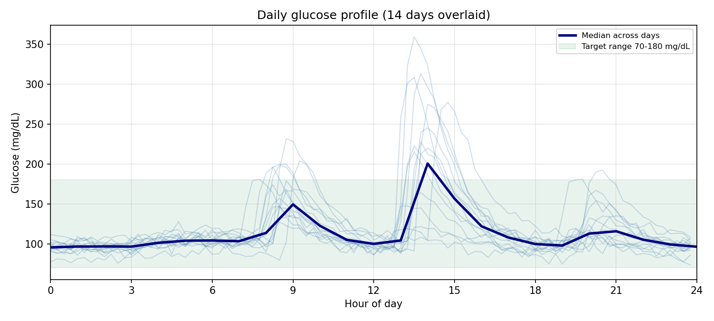

<!--
Generated output, committed so the repo can be read without running it.
Regenerate with:  python run_report.py --out out/agent
-->

# Example output

This is a real, unedited report from `run_report.py`, committed so you can see
what the system produces without needing credentials.

| | |
| --- | --- |
| Generated | 2026-08-06 |
| Model | Claude Opus 4.6 (`bedrock/eu.anthropic.claude-opus-4-6-v1`) |
| Prompt | `prompts/metabolic_scorecard.md` (paper matrix prompt 1) |
| Skills | clinical-language-guard, diet-qc-guard, metabolic_health_report |
| Data | `data/synthetic_001/` (synthetic, seeded) |
| Evals | 5/5 pass, mean score 1.00 |

Two things worth noticing.

**It declines most of what the prompt asked for.** The scorecard prompt wants
letter grades, a cardiovascular risk assessment and a comparison against peers.
None is groundable with four tools, so the report says so and explains why. That
opening note is *not* templated in any skill — the model produced it. Regenerate
and it may be phrased differently, or placed differently. The refusal itself is
reliable; its shape is not.

**Every number traces to a tool.** The critical-metrics table carries values at
full tool precision so the evals can match them, while the prose rounds. The
three flagged diet entries are the faults `data/make_synthetic_data.py` seeds
deliberately, so the QC tool has something real to report.

This file is a snapshot and is not regenerated by the test suite, so it will
drift from the code over time. The date above is how you tell.

---

# Metabolic Health Report

> **A note on your request:** You asked for grades across glucose health, metabolic risk, and cardiovascular risk, and for a comparison against people your age and sex. This system does not compute risk scores, letter grades, or population percentile comparisons — no tool in this build performs those calculations, so any such figure would be invented. What follows is a structured report grounded in your actual CGM and diet data, written as tightly as possible while preserving the detail that makes each claim auditable.

---

## Executive Summary

Your 14-day continuous glucose monitor recorded 1,344 readings with no data gaps, showing a mean glucose of 116 mg/dL and 93% of readings within the 70–180 mg/dL range — just above the consensus target of 70%. Your glucose variability (CV of 31%) sits within the consensus target of 36% or below, though day-to-day consistency varied notably: your most stable day (January 7th) held a CV of 9% and 100% time in range, while January 3rd and 8th each saw CV above 45% with readings exceeding 250 mg/dL.

You logged 126 food items across the full 14 days in a consistent three-eating-time pattern, with 97.6% of entries passing quality validation. Your top opportunity: understanding what differs on your high-variability days (January 3rd, 5th, 6th, 8th, 9th) compared to your stable days, and discussing those patterns with your healthcare provider.

---

## What You Can Do

Your data points to two modifiable focus areas.

**1. Investigate your high-variability days.** On six of your fourteen days, glucose exceeded 180 mg/dL for more than 5% of readings — with January 3rd, 5th, and 8th each producing readings above 250 mg/dL. Identifying what distinguishes these days from your stable ones (January 7th, 10th, 11th, 13th) is the single highest-value next step. Consider noting activity, stress, or sleep differences on those days and sharing the pattern with your healthcare provider.

**2. Strengthen your meal logging detail.** Three of your 126 entries did not pass quality validation, and the current data does not allow this system to link specific meals to glucose responses. More detailed logging — including precise portion sizes and complete nutritional information — would enable richer analysis in future monitoring periods.

---

## Your Health Profile

The following sections provide detailed findings from your monitoring period, including glucose patterns and dietary logging.

### Your Glucose Patterns

Over your 14-day monitoring period (January 1–14, 2024), your glucose averaged 116 mg/dL with 93% of readings falling within the 70–180 mg/dL range — above the consensus target of 70% (Battelino et al., *Diabetes Care* 2019). Your coefficient of variation of 31% indicates moderate fluctuation, within the consensus target of 36% or below. You experienced zero readings below 70 mg/dL throughout the entire period, against a consensus target of under 4%.

Your most stable day was January 7th (mean 102 mg/dL, CV 9%, 100% time in range), while your highest-variability days were January 3rd (CV 47%, mean 119 mg/dL) and January 8th (CV 46%, mean 111 mg/dL). Daily means ranged from 102 mg/dL (January 7th) to 134 mg/dL (January 5th). Readings above 180 mg/dL occurred on 12 of 14 days, but only January 3rd, 5th, 8th, 9th, and 14th exceeded 250 mg/dL. Your mean amplitude of glycaemic excursions (MAGE) was 100 mg/dL across the period, reflecting the episodic spikes on those higher-variability days.

| Metric | Value |
|--------|-------|
| **Mean Glucose** | 116.49 mg/dL |
| **CV** | 30.59% |
| **Time in Range (70-180 mg/dL)** | 93.45% |
| **Time Above 180 mg/dL** | 6.55% |
| **GMI** | 6.10% |

### Your Diet

You logged 126 food items over the 14-day period (January 1–14, 2024). Entries clustered at three consistent times each day — typically around 8:00 AM, 12:30–1:00 PM, and 7:00–8:00 PM — spanning an eating window of approximately 11–12 hours. Recurring items included wholemeal toast, black coffee, chicken breast, lentil soup, wholemeal pasta, steamed broccoli, dark chocolate, scrambled eggs, and Greek yoghurt.

A representative day from your logging, January 1st, included a morning entry at 8:19 AM (porridge with milk, black coffee, wholemeal toast), a midday entry at 1:25 PM (wholemeal pasta, grilled chicken breast, lentil soup), and an evening entry at 7:42 PM (dark chocolate, steamed broccoli, baked salmon).

**Meal Data Quality:** Quality validation was performed on all 126 logged entries. Pass: 123 entries (97.6%), Check: 0 (0.0%), Fail: 3 (2.4%).

---

## Technical Appendix

### Data Quality Assessment

**CGM Coverage:**
- Total readings: 1,344 across 14 days (96 readings/day at 15-minute intervals)
- Coverage: 100% — no gaps, no missing values, no duplicates
- Valid days: 14 of 14
- Original units: mg/dL (no conversion applied)
- Sampling interval: 900 seconds (15 minutes)

**Meal Logging Quality:**
- Total entries: 126 across 14 days
- Quality validation results: Pass 123 (97.6%), Check 0 (0.0%), Fail 3 (2.4%)
- Failed groups: completeness+consistency (1 entry), range (1 entry), consistency (1 entry)
- Optional columns missing: 0
- Interpretation: One entry had implausible portion size or daily total values; one had incomplete data with internally inconsistent nutrition figures; one had internally inconsistent nutrition figures alone. These three entries represent a small fraction and do not materially affect the dietary summary above.

**Limitations:**
- No population comparison tool is available in this build; all comparisons are to the reader's own period statistics or to named consensus targets
- No meal-to-glucose linkage tool is available; causal relationships between specific foods and glucose responses cannot be assessed
- No per-day energy or macronutrient totals are computed by any tool in this build
- No predictive models or risk scores are available

### Complete Metrics

| Metric | Value | Units |
|--------|-------|-------|
| Mean Glucose | 116.49 | mg/dL |
| Median Glucose | 104.25 | mg/dL |
| SD | 35.63 | mg/dL |
| CV | 30.59 | % |
| GMI | 6.10 | % |
| MAGE | 100.39 | mg/dL |
| J-index | 23.14 | — |
| Time in Range (70–180) | 93.45 | % |
| Time Below 70 | 0.00 | % |
| Time Below 54 | 0.00 | % |
| Time Above 180 | 6.55 | % |
| Time Above 250 | 1.49 | % |
| Days Valid | 14 | days |

**Daily Breakdown:**

| Date | Mean (mg/dL) | CV (%) | TIR 70-180 (%) | Above 180 (%) | Above 250 (%) |
|------|------|--------|----------------|---------------|---------------|
| 2024-01-01 | 119.4 | 22.8 | 94.8 | 5.2 | 0.0 |
| 2024-01-02 | 113.7 | 23.9 | 94.8 | 5.2 | 0.0 |
| 2024-01-03 | 119.4 | 47.0 | 90.6 | 9.4 | 5.2 |
| 2024-01-04 | 118.3 | 26.8 | 94.8 | 5.2 | 0.0 |
| 2024-01-05 | 133.7 | 28.5 | 88.5 | 11.5 | 3.1 |
| 2024-01-06 | 128.2 | 24.9 | 86.5 | 13.5 | 0.0 |
| 2024-01-07 | 102.3 | 8.7 | 100.0 | 0.0 | 0.0 |
| 2024-01-08 | 111.4 | 45.7 | 88.5 | 11.5 | 5.2 |
| 2024-01-09 | 122.5 | 37.4 | 92.7 | 7.3 | 4.2 |
| 2024-01-10 | 105.4 | 19.8 | 96.9 | 3.1 | 0.0 |
| 2024-01-11 | 107.8 | 18.2 | 100.0 | 0.0 | 0.0 |
| 2024-01-12 | 121.0 | 26.9 | 89.6 | 10.4 | 0.0 |
| 2024-01-13 | 106.1 | 21.6 | 99.0 | 1.0 | 0.0 |
| 2024-01-14 | 121.8 | 32.6 | 91.7 | 8.3 | 3.1 |

### Methodology Notes

- CGM metrics were computed using the iglu-python backend
- All 14 days met validity criteria (100% coverage each day)
- Reference ranges cited are published consensus values from Battelino et al., *Diabetes Care* 2019 — they are not derived from this reader's peers or any population cohort
- Meal quality validation used automated checks for completeness, range plausibility, and internal consistency
- This build does not include: population comparison tools, meal-glucose response linkage, predictive models, dietary quality indices, or literature search capabilities

## Daily Glucose Profile

